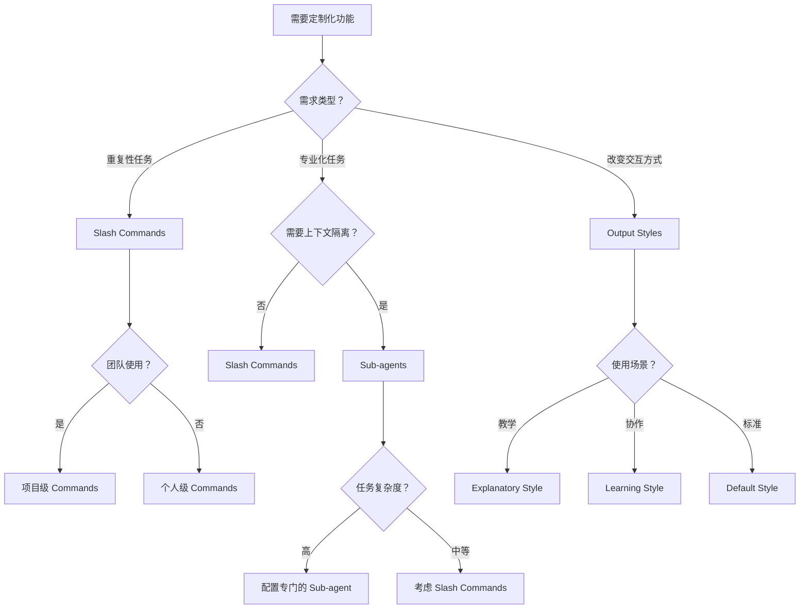

# Claude Code 三大功能完全指南：Custom Slash Commands、Sub-agents、Output Styles

## 概述

Claude Code 提供了三种核心的定制化功能，每种功能从不同技术层面解决定制化需求：

### 核心定位

| 功能 | 本质定义 | 技术实现 | 作用范围 |
|------|----------|----------|----------|
| **Custom Slash Commands** | "stored prompts"<br/>存储的提示词 | 将提示词封装为可复用命令 | 单次交互 |
| **Sub-agents** | "specialized task handlers"<br/>专业化任务处理器 | 独立代理，包含模型、工具、触发条件配置 | 特定任务类型 |
| **Output Styles** | "stored system prompts"<br/>存储的系统提示词 | 完全替换系统提示词，关闭默认软件工程行为 | 系统级行为模式 |

### 与相关功能的技术区别

| 对比维度 | Output Styles | CLAUDE.md | --append-system-prompt |
|----------|---------------|-----------|------------------------|
| **系统提示词处理** | 完全替换默认系统提示词 | 在默认系统提示词后添加用户消息 | 在默认系统提示词后追加内容 |
| **软件工程功能** | 完全关闭默认的软件工程行为 | 保留默认行为 | 保留默认行为 |
| **影响范围** | 根本性行为改变 | 补充性信息添加 | 增量式功能扩展 |

### 层次关系

```
系统级行为 ← Output Styles (stored system prompts)
    ↓
任务处理 ← Sub-agents (specialized task handlers)  
    ↓
提示复用 ← Slash Commands (stored prompts)
```

理解这三者的技术本质和层次关系，能帮助你选择最适合的解决方案。

---

## 一、Custom Slash Commands：可复用的提示词模板

### 核心概念

**Custom Slash Commands 是将常用的提示词封装成可复用的命令**，本质上是"智能快捷键"。它们共享主上下文，能够访问当前对话的所有信息，适合标准化重复性任务。

### 技术特性

**存储方式**：
- 项目级命令：存储在 `.claude/commands/` 目录，使用 `/project:` 前缀
- 个人命令：存储在 `~/.claude/commands/` 目录，使用 `/user:` 前缀

**功能特点**：
- 支持动态参数：通过 `$ARGUMENTS` 占位符传递参数
- 层级组织：支持子目录创建命名空间（如 `/project:frontend:component`）
- 版本控制：项目命令可以随代码库一起版本控制和团队共享

### 适用场景

**最佳场景**：
- 代码格式检查：`/lint @src/main.py`
- 生成标准化内容：`/commit-message`、`/changelog`
- 文档处理：`/translate-zh @README.md`
- 重复性分析：`/performance-check @components/`

**团队协作**：
- 标准化开发流程
- 共享最佳实践
- 确保输出格式一致性

### 优势与限制

**优势**：
- 🚀 **高效快捷**：一键执行复杂提示词
- 🤝 **团队协作**：可共享和版本控制
- 💰 **Token 经济**：避免重复输入长提示词
- 🔄 **上下文连续**：充分利用当前对话信息

**限制**：
- 📝 **格式限制**：仅支持 Markdown 格式
- 🚫 **无条件逻辑**：不支持复杂的条件判断
- 🔀 **上下文依赖**：可能受到主对话的"污染"

---

## 二、Sub-agents：专业化的独立任务处理器

### 核心概念

**Sub-agents 是独立的 AI 专家**，每个都有自己的角色定位、工具权限和独立的上下文窗口。它们专注于特定类型的任务，不受主对话干扰。

### 技术特性

**配置方式**：
- 使用 Markdown 文件 + YAML 前置元数据
- 可自定义系统提示词、工具权限、模型选择
- 支持工具限制（如只读文件、特定 API 访问）

**工作模式**：
- **自动委派**：Claude Code 根据任务描述自动选择合适的 sub-agent
- **手动调用**：用户明确指定使用某个 sub-agent
- **独立上下文**：每次调用都是"clean slate"，不受主对话影响

### 适用场景

**专业化任务**：
- 🔍 **代码审查专家**：专注于发现逻辑错误、安全漏洞、性能问题
- 🐛 **调试助手**：分析日志、运行测试、定位问题
- 📊 **数据分析师**：处理数据、生成报告、创建可视化
- 🏗️ **架构师**：系统设计、技术选型、架构评估

**安全敏感场景**：
- 限制工具权限，确保 sub-agent 只能执行特定操作
- 隔离不同安全级别的任务

### 优势与限制

**优势**：
- 🎯 **任务专注**：独立上下文避免干扰
- 🔒 **权限控制**：精确限制工具访问
- 👥 **团队共享**：可配置标准化的专家角色
- 🧠 **专业化**：针对特定任务优化

**限制**：
- ⏱️ **上下文重建**：每次都需要重新理解项目背景
- 💾 **内存独立**：无法记住之前的交互
- 🔧 **配置复杂**：需要更多的初始设置

---

## 三、Output Styles：系统级的交互方式定制

### 核心概念

**Output Styles 是系统级的行为模式切换**，通过完全替换 Claude Code 的系统提示词来改变整体交互方式。这不是增量修改，而是根本性的行为转换。

### 技术特性

**实现机制**：
- 完全替换系统提示词，而非部分修改
- 同时只能激活一种 output style
- 影响所有后续交互，直到切换为其他模式

**内置样式**：
- **Default**：标准软件工程模式
- **Explanatory**：教学模式，提供详细解释和教育性反馈
- **Learning**：协作模式，留下 TODO 让用户参与编码过程

### 适用场景

**教育培训**：
- 新手学习编程
- 代码审查中的知识传授
- 最佳实践解释

**协作开发**：
- 结对编程场景
- 逐步引导式开发
- 技能提升训练

**非软件工程任务**：
- 将 Claude Code 适配为其他领域的助手
- 保持文件操作能力但改变专业focus

### 优势与限制

**优势**：
- 🎭 **完全转换**：彻底改变交互体验
- 📚 **教育价值**：特别适合学习场景
- 🔄 **保持能力**：维持核心的文件和脚本操作能力
- 🎨 **个性化**：可创建完全定制的交互方式

**限制**：
- 🔄 **全局影响**：无法部分应用，影响所有交互
- ⚡ **单一激活**：同时只能使用一种 output style
- 🎯 **专业性丢失**：非默认模式可能减弱软件工程专业性

---

## 四、功能对比与选择指南

### 核心定位对比

| 功能 | 核心定位 | 作用范围 | 上下文 |
|------|----------|----------|--------|
| **Slash Commands** | 提示词模板化 | 单次任务 | 共享主上下文 |
| **Sub-agents** | 任务专业化 | 特定任务类型 | 独立上下文 |
| **Output Styles** | 交互方式定制 | 整体行为 | 系统级影响 |

### 使用场景矩阵

| 需求场景 | 推荐方案 | 理由 |
|----------|----------|------|
| **重复性任务** | Slash Commands | 快捷高效，减少重复输入 |
| **专业化任务** | Sub-agents | 专注专业，避免干扰 |
| **团队标准化** | Slash Commands + Sub-agents | 可共享配置，标准化流程 |
| **教育培训** | Output Styles | 改变交互方式，更适合学习 |
| **复杂项目** | 组合使用 | 不同层面解决不同问题 |
| **个人工作流** | 主要使用 Slash Commands | 简单高效，满足大部分需求 |

### 技术选型决策树



---

## 五、实际应用建议

### 个人开发者

**推荐策略**：以 Slash Commands 为主，按需使用其他功能

1. **起步阶段**：创建常用的 Slash Commands
2. **进阶阶段**：为复杂任务配置 Sub-agents
3. **特殊需求**：使用 Output Styles 改变交互方式

### 团队开发

**推荐策略**：标准化配置，团队共享

1. **建立团队标准**：共享的项目级 Slash Commands
2. **专业化分工**：配置不同角色的 Sub-agents
3. **培训支持**：使用 Output Styles 进行新人培训

### 学习场景

**推荐策略**：以 Output Styles 为主，辅以专业化指导

1. **设置学习模式**：使用 Explanatory 或 Learning styles
2. **专业指导**：配置教学型 Sub-agents
3. **练习巩固**：使用 Slash Commands 进行重复练习

---

## 六、最佳实践建议

### Slash Commands 最佳实践

- ✅ 明确定义输入输出格式
- ✅ 使用清晰的命名约定
- ✅ 在提示词中指定上下文范围
- ✅ 定期整理和优化命令库

### Sub-agents 最佳实践

- ✅ 单一职责原则，每个 agent 专注一类任务
- ✅ 明确定义工具权限，最小化访问范围
- ✅ 提供清晰的角色描述和使用场景
- ✅ 定期评估和更新 agent 配置

### Output Styles 最佳实践

- ✅ 根据具体场景选择合适的 style
- ✅ 在长期项目中保持 style 一致性
- ✅ 及时切换回适合的模式
- ✅ 为特殊需求创建自定义 styles

---

## 七、总结

这三个功能代表了 Claude Code 定制化的三个不同层面：

- **Slash Commands** 解决效率问题：让重复性任务变得快捷
- **Sub-agents** 解决专业化问题：让复杂任务得到专业处理  
- **Output Styles** 解决适配问题：让交互方式符合特定需求

**关键建议**：
1. **从简单开始**：先使用 Slash Commands 解决常见需求
2. **按需进阶**：当任务复杂化时考虑 Sub-agents
3. **特殊场景**：在教学、协作等特殊需求时使用 Output Styles
4. **组合使用**：这三个功能可以协同工作，不是互斥的选择

选择合适的工具解决合适的问题，避免过度工程化，这是使用 Claude Code 这些功能的核心原则。